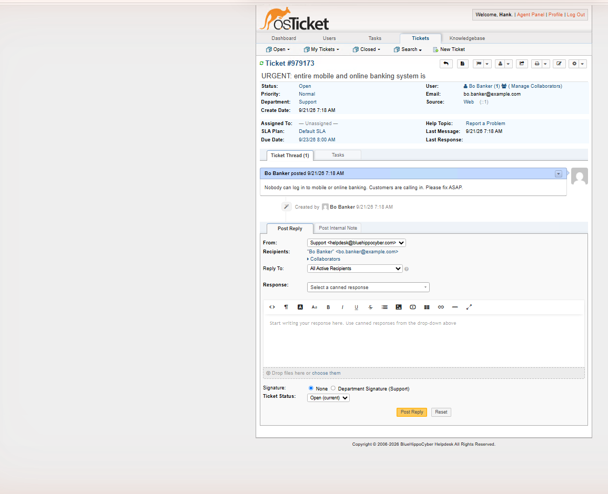
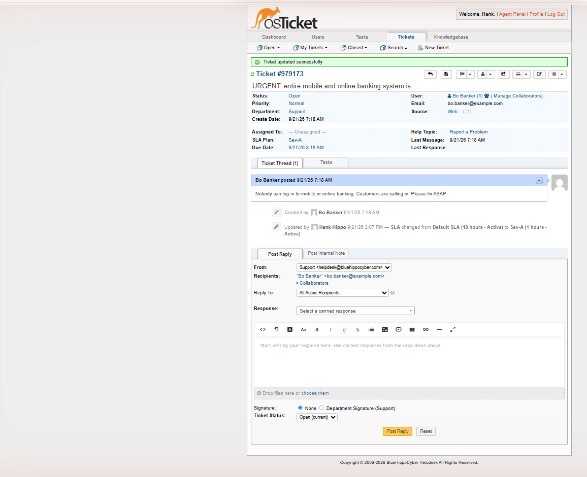
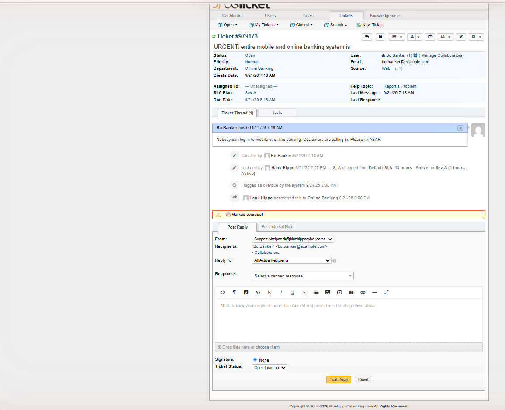
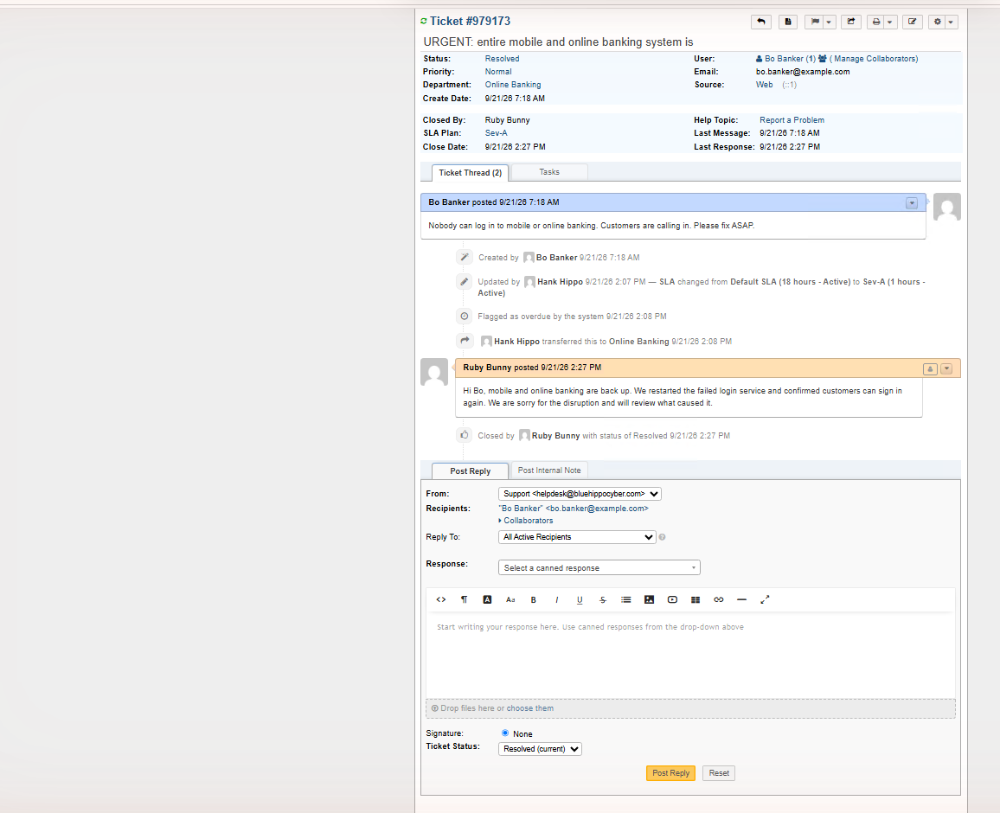
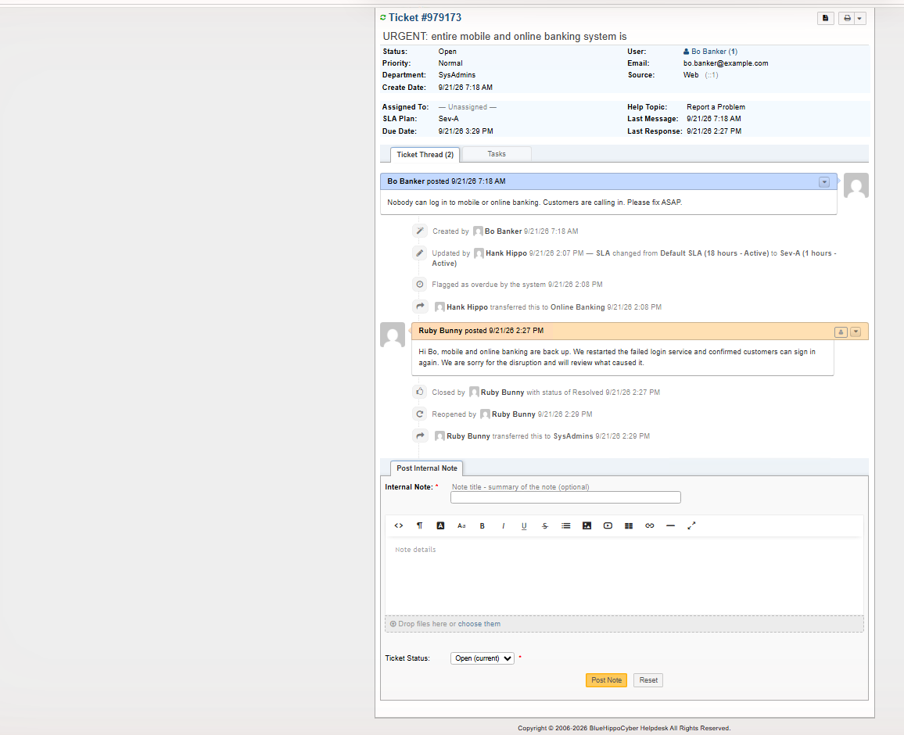
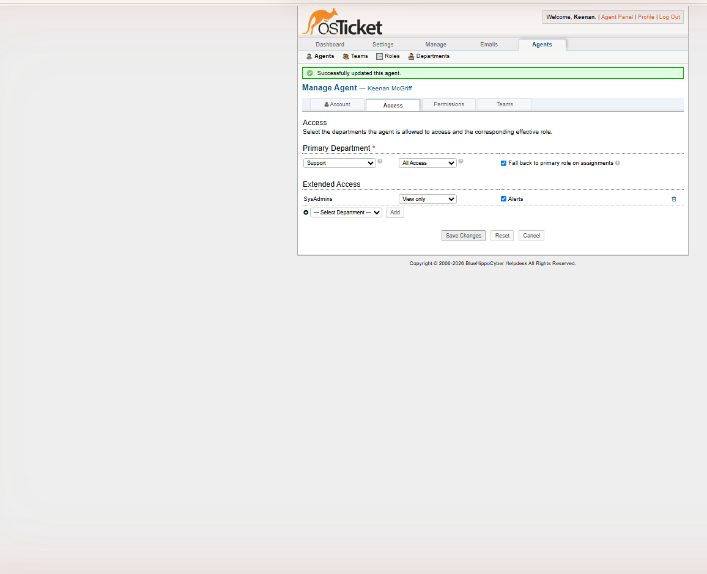
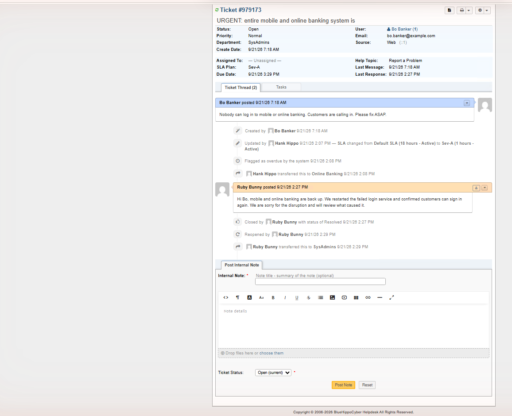

# Azure Cloud Fundamentals Lab 3

## Building an IT help desk (osTicket) on an Azure Windows VM, then running real ticket workflows

This lab documents installing the open-source osTicket help desk on a Windows 10 virtual machine in Azure, then using it the way a support team would: departments, SLA plans, two agents with different access, and three tickets worked from creation to resolution, plus an escalation to a restricted department.

## What I completed

- Created resource group `rg-bhc-lab3-osticket` in East US 2 and deployed `osticket-vm` (Windows 10 Enterprise 22H2, `Standard_D4ls_v6`, 4 vCPU, 8 GiB).
- Installed the stack by hand: IIS with CGI, PHP Manager, URL Rewrite, PHP 7.3.8, MySQL 5.5.62, HeidiSQL, and osTicket 1.15.8. Enabled the PHP extensions osTicket needs, ran the web installer, then removed the `setup` folder and set `ost-config.php` read-only.
- Created departments (SysAdmins, Online Banking, Support) and deleted the unused Maintenance department.
- Created two SLA plans: Sev-A (1 hour, 24/7) and Sev-B (4 hours, 24/7).
- Created two agents with different access: Hank Hippo (primary Support, extended Online Banking) and Ruby Bunny (primary Online Banking).
- Opened three tickets as an end user and worked them: a banking outage, an Adobe upgrade request, and a CFO laptop that would not power on.
- Escalated the outage to SysAdmins, then granted a View-only role in the admin panel and confirmed the ticket could be seen but not edited.
- Stopped (deallocated) the VM afterward so compute billing stopped.

## Architecture

```text
Resource group: rg-bhc-lab3-osticket (East US 2)
  osticket-vm  Windows 10 Enterprise 22H2, D4ls_v6
    IIS + CGI  ->  PHP 7.3.8 (FastCGI)  ->  osTicket 1.15.8
    MySQL 5.5.62 (database: osTicket), managed with HeidiSQL
  Departments: Support (default), Online Banking, SysAdmins
  SLA plans: Default (18h), Sev-A (1h), Sev-B (4h)
  Agents: hhippo (Support + Online Banking), rbunny (Online Banking), bluehippo (admin)
```

## The ticket workflow, step by step

| Step | What I did | What I saw |
|---|---|---|
| Triage | Opened the banking outage ticket as agent `hhippo` | A new ticket defaults to Normal priority, Support department, unassigned, Default SLA (18 hours), even for a full outage. Triage is the agent's job. |
| SLA | Changed the SLA plan to Sev-A | Due date moved from two days out to one hour after creation, and the thread logged the change. |
| Transfer | Transferred the ticket to Online Banking | The system flagged it **overdue** because the one-hour Sev-A window had already passed. |
| Routing | Set the Adobe and CFO laptop tickets to Sev-B, left them in Support | Due 4 hours after creation. Resolved both as `hhippo`. |
| Access | Logged in as `rbunny` | Her queue showed only the Online Banking ticket. She never sees Support tickets. |
| Resolution | Replied and resolved the outage as `rbunny` | Closed By shows Ruby Bunny. The full history from both agents stayed in one thread. |
| Escalation | Ruby transferred the resolved ticket to SysAdmins | It disappeared from her queues. It also **reopened** the ticket and restarted the Sev-A clock. She could still open it by direct link, but only in a restricted view (internal note only). |
| Admin access | Even the admin could not see it in the queue until I added SysAdmins with the **View only** role | After that it appeared, with no reply, edit, assign or transfer controls. |

## Evidence highlights

### Ticket defaults before triage


### SLA changed to Sev-A


### Transferred to Online Banking and flagged overdue


### Full history across two agents, resolved


### Escalated to SysAdmins: restricted view


### Admin granted View only on SysAdmins


### View-only ticket, no edit controls


The `evidence/` folder holds all 21 screenshots, including the install and configuration steps.

## What I learned

- **Triage is a human decision.** The help desk does not know an outage is urgent until someone sets priority, SLA and department.
- **SLA plans drive the overdue flag.** Changing the plan recalculated the due date, and the system flagged the breach automatically.
- **Departments are access control.** What an agent can see and do depends on department membership and role, not just login.
- **A View-only role really is read-only**, and access can be granted per department.
- **Email is part of the workflow.** In a real deployment every ticket event (new ticket, reply, assignment, overdue) emails the requester and agents, and tickets can also be created by email, phone, chat or in person. This lab VM has no mail server, so no email was actually sent.

## Honest notes

- Agent names (Hank Hippo, Ruby Bunny) and every email address are fictional, replacing the lab's default names.
- I typed nothing sensitive into screenshots: passwords were entered by me and never captured, and the public IP is cropped out.
- The VM was **stopped (deallocated), not deleted**. The resource group `rg-bhc-lab3-osticket` still exists, so the disk and public IP still cost a small amount.
- This is a personal training lab, not client work.
